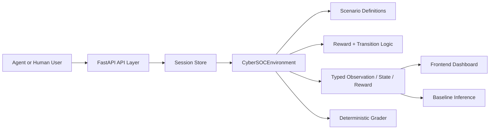

# Autonomous CyberSOC OpenEnv++

Autonomous CyberSOC OpenEnv++ is a deterministic, real-world Security Operations Center (SOC) simulation for training and evaluating AI agents on analyst workflows. Instead of solving a toy task, the agent must behave like a blue-team defender: read noisy alerts, inspect suspicious evidence, choose response actions, manage trade-offs, and stop attacker progression before business-critical assets are damaged.

The project implements an OpenEnv-style environment with:

- typed `Action`, `Observation`, `Reward`, and `State` models
- full `reset()`, `step()`, and `state()` workflow
- three deterministic tasks from easy to hard
- programmatic graders with validator-safe scores strictly inside `(0, 1)`
- dense reward shaping across the whole trajectory
- a baseline `inference.py` script that uses the OpenAI client
- a FastAPI service with session-isolated episodes
- a browser dashboard for manual interaction and debugging
- Docker and Hugging Face Space readiness

## Submission Links

- Hugging Face Space: [https://huggingface.co/spaces/kalpesh911/CyberSOC](https://huggingface.co/spaces/kalpesh911/CyberSOC)
- Live environment: [https://kalpesh911-CyberSOC.hf.space](https://kalpesh911-CyberSOC.hf.space)
- GitHub repo: [https://github.com/krushna1221/CyberSOC](https://github.com/krushna1221/CyberSOC)
- TRL Colab notebook: [https://colab.research.google.com/github/krushna1221/CyberSOC/blob/main/training/cybersoc_trl_minimal_colab.ipynb](https://colab.research.google.com/github/krushna1221/CyberSOC/blob/main/training/cybersoc_trl_minimal_colab.ipynb)
- Training scripts: [training/generate_sft_dataset.py](training/generate_sft_dataset.py), [training/train_trl_sft.py](training/train_trl_sft.py)
- YouTube demo: [https://www.youtube.com/watch?v=R-3gXeFsGPM](https://www.youtube.com/watch?v=R-3gXeFsGPM)

## Submission Materials Checklist

- [x] OpenEnv environment with `reset`, `step`, `state`, and `openenv.yaml`
- [x] Hugging Face Space deployment
- [x] Baseline inference runner and deterministic graders
- [x] Minimal HF TRL Colab notebook and training scripts
- [x] Public YouTube demo link
- [ ] Upload final reward/loss plots from a real training run
- [ ] Link your Hugging Face mini-blog or slide deck if you create one
- [ ] Replace placeholder training results below with your onsite run artifacts

## Why This Environment Matters

Modern SOC teams do not solve abstract puzzles. They deal with:

- alert fatigue
- false positives
- incomplete visibility
- delayed response costs
- attacker adaptation
- business disruption from bad defensive actions

Most cyber simulations focus on low-level infrastructure mechanics. This environment instead focuses on human analyst decision quality, which makes it more useful for benchmarking autonomous security agents.

## What The AI Actually Does

The AI agent acts like a SOC analyst. On every step it:

1. reads the current observation
2. decides whether an alert is real or false
3. selects a response action
4. accepts the cost and time trade-offs of that decision
5. reacts to attacker progression and newly revealed evidence

Available actions:

- `triage_alert`
- `isolate_node`
- `patch_system`
- `block_indicator`
- `request_forensics`
- `escalate_incident`
- `ignore_alert`
- `noop`

## Task Suite

| Task ID | Difficulty | Goal | Final Score |
|---|---|---|---|
| `alert-triage-easy` | Easy | Classify noisy alerts correctly | `correct classifications / total alerts` |
| `incident-containment-medium` | Medium | Stop lateral movement before critical spread | `1 - (uncontained infected nodes / total nodes)` |
| `soc-optimization-hard` | Hard | Balance damage reduction, response cost, and delay | `1 - (0.5 * damage + 0.3 * cost + 0.2 * delay)` |

## Environment Design

### Action Space

The environment uses typed `CyberSOCAction` objects.

| Action | Required Fields | Purpose |
|---|---|---|
| `triage_alert` | `alert_id`, `classification` | Mark an alert as true or false |
| `isolate_node` | `node_id` | Cut off a host to stop spread |
| `patch_system` | `node_id` | Close a vulnerable or backup path |
| `block_indicator` | `indicator` | Block a malicious IOC such as a C2 |
| `request_forensics` | `node_id` | Reveal deeper evidence for a node |
| `escalate_incident` | `node_id` or `alert_id` | Escalate for higher-level response |
| `ignore_alert` | `alert_id` | Explicitly ignore likely noise |
| `noop` | none | Take no effective action |

### Observation Space

Every `CyberSOCObservation` includes:

- task briefing
- current step and episode limits
- pending alerts
- recent logs
- node overview
- threat level
- visible indicators
- available actions
- last action result
- analyst notes

Each action result now also carries lightweight explainability:

- confidence score
- short reasoning bullets
- impact summary

The agent does not get the full internal compromise graph directly. Hidden state is surfaced through alerts, logs, and defensive investigation.

### Reward Design

Rewards are dense rather than sparse. The environment returns positive signal for useful triage, containment, patching, blocking, and forensic actions, and penalizes delay, wasted actions, repeated identical actions, bad triage, attacker spread, and accumulated damage.

## Curated Reference Data

The package now also includes a small curated alert reference set in `cybersoc_openenv/data/curated_alerts.json`. It is designed for:

- offline evaluation and regression checks
- sanitized few-shot prompt examples inside `inference.py`
- demos that compare alert evidence, expected labels, and recommended response patterns

The dataset covers all three task families and includes both true positives and false positives across phishing, malware, impossible travel, token replay, lateral movement, credential theft, data exfiltration, PowerShell abuse, and anomaly-style alerts. Live prompt examples intentionally omit direct answer keys so the benchmark still measures decision quality rather than copying reference labels.

## Technical Architecture



### Main Components

- `cybersoc_openenv/environment.py`: core transitions, reward logic, attacker progression, episode boundaries
- `cybersoc_openenv/datasets.py`: packaged curated alert dataset loader and few-shot selector
- `cybersoc_openenv/training.py`: shared prompt, heuristic, and rollout helpers for SFT data generation
- `cybersoc_openenv/scenarios.py`: task definitions, alerts, logs, attack graphs, budgets, indicators
- `cybersoc_openenv/models.py`: typed Pydantic models
- `cybersoc_openenv/graders.py`: deterministic task scoring
- `server/app.py`: FastAPI app, session management, static file serving
- `server/static/cybersoc.html`: browser dashboard
- `server/static/soc.js`: frontend controller and backend integration
- `inference.py`: required baseline runner

## End-to-End Workflow

1. Client calls `/reset` with a `task_id` and optional `seed`.
2. FastAPI creates or reuses a session-isolated `CyberSOCEnvironment`.
3. The environment returns the initial typed observation.
4. The agent or UI sends a typed action to `/step`.
5. The environment validates the action, applies state transitions, advances attacker logic, computes dense reward with progress shaping and repeated-action penalties, and checks terminal conditions.
6. At episode end, the final state is scored by deterministic task-specific graders.

## Worked Example

### Task 2: Incident Containment

Initial situation:

- `ws-23` is the real compromised workstation
- `vpn-01` has a low-confidence alert that is mostly noise
- the attacker can pivot toward `fs-02`, `backup-01`, and `dc-01`

A strong response sequence is:

1. `patch_system(vpn-01)`
2. `isolate_node(ws-23)`
3. `triage_alert(ALT-M1, true_positive)`
4. `triage_alert(ALT-M2, false_positive)`

This closes the backup path, contains the initial foothold, clears the queue correctly, and protects the containment score.

## HTTP API

| Route | Method | Purpose |
|---|---|---|
| `/` | `GET` | Serve the frontend dashboard |
| `/api/status` | `GET` | API health and task catalog |
| `/health` | `GET` | Simple readiness endpoint |
| `/tasks` | `GET` | List tasks |
| `/reset` | `GET/POST` | Start a task episode |
| `/step` | `POST` | Apply one action |
| `/observation` | `GET` | Return current observation |
| `/state` | `GET` | Return current full environment state |
| `/metrics` | `GET` | Return session or global evaluation metrics |

The backend uses session-isolated environments, so multiple users can interact with the deployed Space safely.

## Frontend Dashboard

The frontend is connected to the real API and supports:

- task selection and reset
- 3D network topology visualization
- live threat metrics
- session evaluation metrics
- alert queue and evidence stream
- explainable action feedback with confidence and reasoning
- action dispatch panel
- episode history
- raw state and observation inspector

## Training Pipeline

The repo now includes a minimal Hugging Face TRL path so judges can rerun training against the environment.

Recommended order:

1. Install training dependencies:

```bash
python -m pip install -e ".[dev,training]"
```

2. Generate heuristic demonstrations:

```bash
python training/generate_sft_dataset.py --episodes-per-task 8 --output artifacts/training/cybersoc_sft_train.jsonl
```

3. Fine-tune a small instruction model with HF TRL:

```bash
python training/train_trl_sft.py \
  --dataset artifacts/training/cybersoc_sft_train.jsonl \
  --output-dir artifacts/training/trl-smollm2 \
  --model HuggingFaceTB/SmolLM2-135M-Instruct \
  --max-steps 40 \
  --per-device-train-batch-size 2 \
  --gradient-accumulation-steps 4
```

4. Commit or link the generated artifacts:

- `artifacts/training/trl-smollm2/training_loss.png` or `.svg`
- `artifacts/training/trl-smollm2/score_comparison.png` or `.svg`
- `artifacts/training/trl-smollm2/training_summary.json`

The Colab-friendly notebook for the same flow is [https://colab.research.google.com/github/krushna1221/CyberSOC/blob/main/training/cybersoc_trl_minimal_colab.ipynb](https://colab.research.google.com/github/krushna1221/CyberSOC/blob/main/training/cybersoc_trl_minimal_colab.ipynb).

## Results and Training Evidence

These are the slots judges expect to see filled after your real onsite run:

- `training_loss.png`: learning curve from the HF TRL run
- `score_comparison.png`: baseline vs trained average task score
- `training_summary.json`: per-task before/after scores
- short caption explaining what improved and why

Current repo status:

- training pipeline files are present
- baseline evaluation is present
- final onsite training artifacts still need to be generated and linked

## Project Layout

```text
.
|-- cybersoc_openenv/
|   |-- client.py
|   |-- datasets.py
|   |-- data/
|   |   |-- curated_alerts.json
|   |   `-- README.md
|   |-- environment.py
|   |-- graders.py
|   |-- models.py
|   |-- training.py
|   `-- scenarios.py
|-- server/
|   |-- app.py
|   `-- static/
|       |-- cybersoc.html
|       |-- soc.css
|       `-- soc.js
|-- training/
|   |-- cybersoc_trl_minimal_colab.ipynb
|   |-- generate_sft_dataset.py
|   |-- README.md
|   `-- train_trl_sft.py
|-- artifacts/
|   `-- training/
|       `-- README.md
|-- tests/
|   |-- test_api.py
|   |-- test_datasets.py
|   |-- test_training.py
|   |-- test_environment.py
|   |-- test_inference.py
|   `-- test_spec.py
|-- Dockerfile
|-- inference.py
|-- openenv.yaml
`-- pyproject.toml
```

## Local Setup

Install dependencies:

```bash
python -m pip install -e ".[dev]"
```

Install the optional training extras:

```bash
python -m pip install -e ".[dev,training]"
```

Run tests:

```bash
python -m pytest -q -p no:cacheprovider
```

Run the app:

```bash
python -m server.app --host 0.0.0.0 --port 7860
```

Or use the console script:

```bash
server --host 0.0.0.0 --port 7860
```

## Docker

```bash
docker build -t cybersoc-openenv .
docker run --rm -p 7860:7860 cybersoc-openenv
```

## Hugging Face Spaces

This repo is structured for a Docker-based Hugging Face Space.

Environment settings:

- `API_BASE_URL`
- `MODEL_NAME`
- `HF_TOKEN`

Key metadata:

- `sdk: docker` is declared in this README front matter
- `app_port: 7860` matches the FastAPI service
- `openenv.yaml` points to `server.app:app`

## Baseline Inference

The required baseline script is `inference.py`.

Supported modes:

- `python inference.py --policy heuristic`
- `python inference.py`

Environment variables:

- `API_BASE_URL`: OpenAI-compatible base URL
- `MODEL_NAME`: model identifier
- `HF_TOKEN`: Hugging Face or compatible API key
- `ENV_BASE_URL`: optional external URL for a running CyberSOC API

## Reference Baseline Scores

Reference heuristic scores from `python inference.py --policy heuristic`:

- Alert Triage: `0.9999`
- Incident Containment: `0.9999`
- SOC Optimization: `0.7382`
- Average: `0.9127`

## Validation and Tests

Current local checks:

- `python -m pytest -q -p no:cacheprovider`
- `python inference.py --policy heuristic`
- local HTTP smoke tests for `/`, `/api/status`, and frontend assets
- `docker build` and `docker run`

## Storytelling Assets

Before final judging, add at least one of these links here:

- YouTube demo under 2 minutes: [https://www.youtube.com/watch?v=R-3gXeFsGPM](https://www.youtube.com/watch?v=R-3gXeFsGPM)
- Hugging Face mini-blog: optional, not provided yet
- Slide deck / presentation: optional, not provided yet

Keep videos external; do not commit large video files into this repo.

## Summary

Autonomous CyberSOC OpenEnv++ is a realistic cyber defense benchmark where an AI agent must interpret noisy evidence, respond under uncertainty, balance security against business cost, and stop attacker spread before critical damage. It combines a deterministic environment core, typed APIs, reproducible grading, a baseline runner, and a connected frontend dashboard in one submission-ready project.
